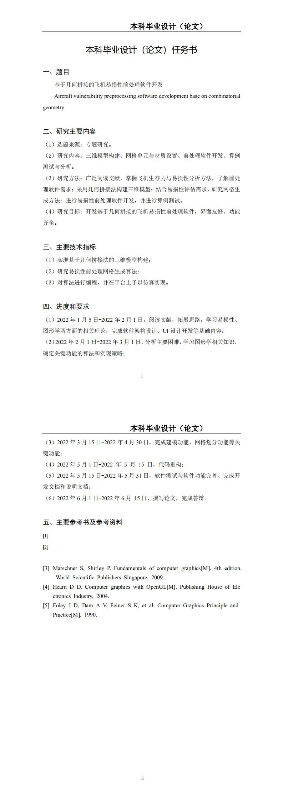

# **毕业设计项目说明**

( )：
## _1、软件下载：_
### https://github.com/ZhangTaiweiNPU/ztwbysj_handbook/releases/tag/VASMv1.0

( )：
## _2、软件说明文档（教程）：_
### 见说明文档.pdf文件

( )：
## _3、软件开发文档：_
### https://zhangtaiweinpu.github.io/ztwbysj_webpage/

( )：
## _4、源码_
### 如需源码，请联系开发者zhangtaiwei_npu@163.com

( )：
## _5、介绍_

